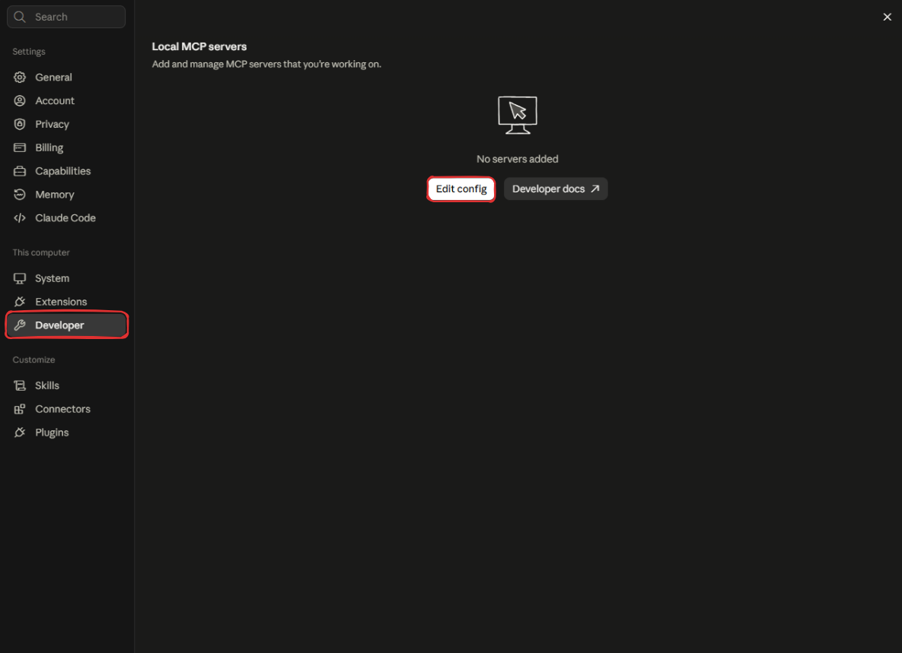

# github-mcp-server

## Problem

LLMs can't see your GitHub data. Their knowledge is fixed at training time, so they know nothing about your repositories, your pull requests and what changed. Asking "which PRs are waiting for review on my repo?" would give you a guess at best, a refusal at worst.

To work around this you'd have to either: 
- **Copy-paste or screenshot into the chat** which is manual and only valid for that moment in time. Doesn't scale beyond a few times.
- **Customize integration for each of your AI apps** and write the same code to authenticate, handle rate limits, handle errors, and response formats. Done for every app that needs GitHub access.

What's needed is a reliable way for an AI application to query live GitHub data safely and without per-app integration work.

## Why MCP

The Model Context Protocol (MCP) fits this exact problem, since it is an open standard for connecting AI applications to external tools and data sources.

- **Build once, use everywhere**. This server works with any MCP compatible client without changes. 
- **Can act on errors reliably**. Failures are returned as tool results with clear messages, so the model can read them and decide what to do next.
- **Self-describing tools**. The model knows what's available, what each tool does and how to call each one without hardcoded instructions.
- **Safe by design**. Tools are labeled read-only so the client knows that they can't modify on GitHub. or write to give access but use the tool with caution.
- **Your token never reaches the model**. The server holds the GitHub token and uses it only to call GitHub. The model sees tool results, never credentials.

## Architecture (TBD)

## Tools

| Tool | Purpose | Inputs | Returns | Token permission |
|---|---|---|---|---|
| `get_repository` | Get metadata about a repository | `owner`, `repo` | description, default_branch, visibility, archived, html_url, is_fork, last_pushed_at | Metadata: read |
| `list_pull_requests` | List pull requests in a repository | `owner`, `repo`, `state` (open / closed / all, default open), `base`, `limit` (1–100, default 30) | pull_requests[], has_more | Pull requests: read |

**Errors**

Failures are returned as `isError` results, so the server never crashes and the model can read what went wrong.

| Situation | What the model is told |
|---|---|
| 404 | The repository was not found. Check the owner and repo spelling. If it is private, the token may not have access. |
| 401 | GitHub rejected the server's credentials. This is a configuration problem, so don't retry. Tell the user the token is missing, expired or revoked. |
| 403 or 429 with rate-limit headers | The rate limit was reached. It includes the reset time, or the `retry-after` seconds. |
| 429 without headers | GitHub is throttling requests. Wait at least one minute. |
| 403 without rate-limit headers | The token isn't allowed to read the repository (missing scope or org SSO authorization). |
| 451 | The repository is unavailable for legal reasons. |
| 5xx or network failure | GitHub or the network failed temporarily. Retrying later may work. |
| Invalid arguments | Rejected by the input schema before the handler runs, with the reason (for example, `limit` cannot exceed 100). |

## How to run

**Requirements:** Node ≥ 20, a GitHub personal access token, WSL or Git Bash.

**1. Install and configure**

```bash
npm install
cp .env.example .env
# set GITHUB_PAT in .env
echo "GITHUB_PAT=replace_with_your_github_token" > .env
```

**2. Build and run**

```bash
npm run build
node build/index.js      # waits for a client on stdio
npm run dev              # TypeScript directly, via tsx
```

**3. Try it using MCP Inspector**

```bash
npx @modelcontextprotocol/inspector node build/index.js
```

<!-- TODO: one line on what to try first (get_repository on a public repo) -->

**4. Connect a host (Claude Desktop example)**

```json
{
  "mcpServers": {
    "github": {
      "command": "node",
      "args": ["/absolute/path/to/github-mcp-server/build/index.js"],
      "env": { "GITHUB_PAT": "your-token" }
    }
  }
}
```

You can find the config file at :
- `~/Library/Application Support/Claude/claude_desktop_config.json` on macOS 
- `%APPDATA%\Claude\claude_desktop_config.json` on Windows.

Alternatively, you can access the config file through the Desktop app from Settings -> Developer -> Edit config :



Restart the host after editing it.

**Troubleshooting**

- **`GITHUB_PAT is required`:** the token isn't set. Add it to `.env` for local runs, or to the `env` block of the host config.
- **The server doesn't show up in the host:** check that the path is absolute, run `npm run build` again, and restart the host.
- **Use `node build/index.js` as the host command, not `npm start`:** npm prints a banner to stdout before the server starts, and any extra stdout breaks the protocol.
- **Every call returns the 401 message:** the token is invalid or expired. Create a new one.

## Decisions

1. **Failures are tool results with `isError`, not protocol errors.** Each tool message names the next step for the model to read and act accordingly. protocol errors does it best for resources, prompts and completions.
2. **Retry policy: 5xx is retried, 403 and 429 are not.** A 5xx is usually a brief outage with no information in it, so retrying is acceptable. A 429 or 403 carries information the model can use (wait n seconds, or fix the token), so it goes straight to the model.
3. **Rate limits reach the model immediately.** The throttle callbacks return `false` so the rate-limit error arrives immediately with the reset time instead of the call hanging. I kept the callbacks over `enabled: false` because the plugin's request pacing may matter once write tools exist.
4. **429 is always a rate limit; 403 without headers is a permission problem.** A 429 never means anything else, so it always gets the throttling message. A 403 is ambiguous, because GitHub uses it for rate limits and permissions, so it only falls back to the permission message when no rate-limit headers are present.
5. **One page per call, with `has_more` read from the `Link` header.** The tool returns a single page on purpose, and the model needs to know whether the list is complete.
6. **Output schemas mirror what GitHub returns.** for example: Fields that GitHub can send as `null` are nullable. Otherwise a successful call could fail output validation, or report wrong data.
7. **The GitHub API version is set in one place.** Changing the version only modifies one line instead of every tool.

## Resources 

- What is Model Context Protocol : https://modelcontextprotocol.io/docs/2026-07-28/getting-started/intro
- introducing the Model Context Protocol : https://www.anthropic.com/news/model-context-protocol 
- build an MCP server : https://modelcontextprotocol.io/docs/2026-07-28/develop/build-server
- NetworkChuck video about MCP : https://www.youtube.com/watch?v=GuTcle5edjk (Build your own MCP server @12:31 and MCP Gateway, Explained @32:51)
- MCP gateway : https://docs.docker.com/ai/mcp-catalog-and-toolkit/mcp-gateway/
- JSON-RPC Specification : https://www.jsonrpc.org/specification
- MCP server concepts : Tools vs Resources vs Prompts : https://modelcontextprotocol.io/docs/learn/server-concepts
- Understanding MCP servers transports : https://dev.to/zoricic/understanding-mcp-server-transports-stdio-sse-and-http-streamable-5b1p
- Permission level per REST endpoint in GitHub : https://docs.github.com/en/rest/authentication/permissions-required-for-fine-grained-personal-access-tokens?apiVersion=2026-03-10
- MCP Typescript SDK v2 : https://ts.sdk.modelcontextprotocol.io/v2/
- MCP inspector : https://modelcontextprotocol.io/docs/2026-07-28/tools/inspector
- GitHub REST endpoints : https://docs.github.com/en/rest/repos/repos?apiVersion=2026-03-10
- Octokit library to utilize GitHub's REST API : https://github.com/octokit/octokit.js#readme