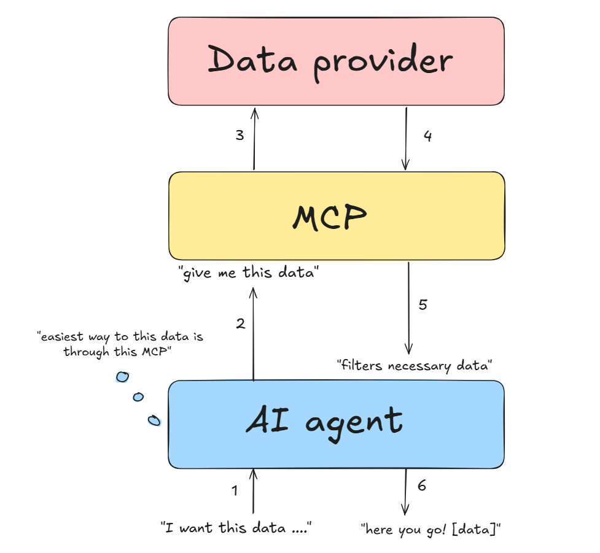

# Notes 

## MCP in my own words

MCP is a new standard way to connect LLMs to different data sources and tools to provide them with more context. Instead of having to deal with all the APIs setup which often doesn't provide total access and requires much more work upfront. This whole two-way connection process is already built inside the MCP so it makes it easier for the AI applications to access the resources.

## MCP concept Diagram

## Server tools

- [read-only] : asking GitHub for information, repeating it is harmless.
- [write] : changes something on GitHub, repeating it could duplicate or alter work.

get_repository — returns information about the repository : description, default branch, visibility, archived status ... — inputs : owner, repo [read-only]

list_issues — returns consice issue summaries (might me sorted by state or label) with no pull requests — inputs : owner, repo, state?, label? [read-only]

get_issue — retuns information about one issue : title, body, state, assignees, url ... — inputs : owner, repo, issue_number [read-only]

list_pull_requests — returns consice pull requests summaries (might also be filtered by state or base branch) with no issues — inputs : owner, repo, state?, base_branch? [read-only]

get_pull_request — returns information about about one pull request : description, author, head and base branches, review state, mergeability, urls ... — inputs : owner, repo, pr_number [read-only]

create_issue_comment — posts a comment on an existing issue — inputs : owner, repo, issue_number, body [write]

create_pr_comment — posts a comment on an existing pull request — inputs : owner, repo, pr_number, body [write]

close_issue — changes an issue's status to closed — inputs : owner, repo, issue_number [write]

close_pull_request — closes an open pull request without merging it or deleting any related branches — inputs : owner, repo, pr_number [write]

delete_feature_branch — permanently deletes a merged feature branch's reference from the repository — inputs : owner, repo, branch, expected_branch_head? [write]

Few design notes :
- I deliberately included `owner` and `repo` as inputs for consistency across all tools.
- I marked optional inputs with `?`. Every tool can be called only with `owner` and `repo` but the results can be filtered optionally when needed.
- Keep issues and PRs separate for a tool to only have a single purpose.
- For the delete_feature_branch, I added `expected_branch_head?` input to check if the branch had any new commits after merging, The model should (optionally) check if the latest commit HEAD matches the latest merged commit. If yes then we can safely delete it. Otherwise, it should output some kind of warning or heads up before deletion.

Need to consider later on the design process :
- Including a limit to the list results, since repositories can be huge and might overwhelm the model with bunch of results.
- The GitHub API response can be messy, so it might be best to think about structuring the data response and the results to follow a predictable pattern with structured fields.
- Filtering issues lists to only have the issues (it might include PRs as well which would be confusing) and vise versa.
- the [write] labeled tools should come with some kind of disclaimer that it may cause some external change so it should be handled differently.
- Every change that is meant to be affecting the state of the issue or pr needs to check the current state before modifying it to avoid conflicts.

## Weekly recap

For this week I learned what is an MCP, what is it for, why would we need it in the first place (if we already have APIs for the same purpose). I learned about the MCP concepts that made a clear distinction that I wasn't considering before about who controls which concept. I also got into transports, where I get the difference between local servers that uses stdio for communication and HTTP which exposes the sever over a network but it has to come with a layer of security OAuth. Lastly is the JSON-RCP protocol.
- Nailed : MCP, concepts, transports.
- Shaky / needs practice : JSON-RPC 2.0
- Hardest / needs revision : Interactive staging with Git `git add -i / -p`
Some key takeaways : 
- For stdio servers never use `console.log()`, as it writes to the standard output which means it will corrupt the JSON-RPC messages and break the server. Best practices would be to write to stderr or files.
- JSON is just a data format. While JSON-RPC is a structured communication protocol that is used to execute actions or command a machine, that is happened to be written in JSON format. 